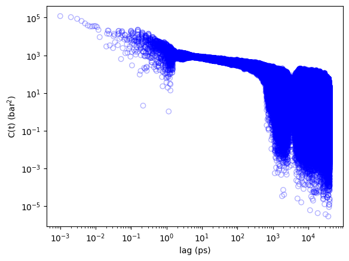

# Stress-tensor trace to $E(\omega)$

1. Run NVE MD with energy output every timestep.  Our deffnm is `nve-GK` so we expect `nve-GK.edr` as the energy output.

2. Use `gmx energy` to save xy, xz, yx, yz, zx, zy stress tensor components vs time to `energy.xvg`

    ```bash
    Command line:
    gmx energy -f nve-GK.edr

    Opened nve-GK.edr as single precision energy file

    Select the terms you want from the following list by
    selecting either (part of) the name or the number or a combination.
    End your selection with an empty line or a zero.
    -------------------------------------------------------------------
     1  Bond             2  Angle            3  Proper-Dih.      4  Improper-Dih.
     5  LJ-14            6  Coulomb-14       7  LJ-(SR)          8  Disper.-corr.
     9  Coulomb-(SR)    10  Coul.-recip.    11  Potential       12  Kinetic-En.
    13  Total-Energy    14  Temperature     15  Pres.-DC        16  Pressure
    17  Vir-XX          18  Vir-XY          19  Vir-XZ          20  Vir-YX
    21  Vir-YY          22  Vir-YZ          23  Vir-ZX          24  Vir-ZY
    25  Vir-ZZ          26  Pres-XX         27  Pres-XY         28  Pres-XZ
    29  Pres-YX         30  Pres-YY         31  Pres-YZ         32  Pres-ZX
    33  Pres-ZY         34  Pres-ZZ         35  #Surf*SurfTen   36  T-rest

    27 28 29 31 32 33
    ```
    (wait a few minutes)

3. Use `acov6.py` to get autocovariance of each component and their collective six-fold average $C(t)$:
    ```bash
    > python acov6.py -od acov6-avg.dat -op acov6-avg.png energy.xvg
    Reading energy.xvg...
    energy.xvg has 40000001 lines
    Wrote acovxy.dat.
    Wrote acovyx.dat.
    Wrote acovxz.dat.
    Wrote acovzx.dat.
    Wrote acovyz.dat.
    Wrote acovzy.dat.
    Wrote 6-fold average to acov6-avg.dat
    Generated acov6-avg.png.
    ```
    This generates the datafile for $C(t)$ vs $t$ called `acov6-avg.dat`, and individual files for each component.  A plot is also generated in `acov6-avg.png`.  The plot below is generated from data from a 40-ns NVE MD trajectory.

    

4. `myacov2e.c` to compute $E$
   ```bash
   > ./myacov2e -lag-max 40000 -stride 100 -o e-100.dat acov-avg6.dat
    Reading acov-avg6.dat...
    Among 40000002 lines, 400001 acceptable lag values less than 4.000000e+04 with stride 100 exist.
    400001 lag values read in. Done.
    Delta: 1.000000e-01 ps
    Computing FFT...
    Unpacking coefficients...
    Writing e-100.dat
   ```
   This generates the output file `e-100.dat`. The lag-max option is required so that arrays
   can be allocated; this is a time in ps.  In this example, we have a 40-ns trajectory, so the maximum
   lag is 40,000 ps.  Although the autocovariance in `acov-avg6.dat` is computed using a fully-resolved time series of the stress tensor components, we use a stride of 100 lags to generate a sparse
   autocovariance with a larger $\Delta t$ to make the FFT tractable.  Note that this does NOT mean we can *sample* the stress tensor components every 100 time steps; it is still necessary to *fully* sample stress tensor components at *all* time steps to give us the best possible statistics from having tha largest possible number of *time origins*.

   (see notes below)

5. `eplt.py` to make the plot
   ```bash
   > python eplt.py e-100.dat
   ```
   

Some notes: $C(t)$ is the straight six-fold average of all off-diagonal stress tensor autocovariances:

$$
C(t) = \frac{1}{6}\sum_{i\in (x,y,z)}\sum_{j\in (x,y,z), j\ne i} \langle\sigma_{ij}(t_0)\sigma_{ij}(t_0+t)\rangle_{t_0}
$$

where
    
$$
\langle\cdot\rangle_{t_0}
$$
    
indicates averaging over all time origins. The relaxation modulus $G(t)$ is related to $C(t)$ via 

$$
G(t) = \frac{V}{k_BT}C(t)
$$

where $V$ is volume, $k_B$ is Boltzmann's constant, and $T$ is temperature.  Note that by default,
`gmx energy` reports stresses in **bar**, so unit conversions are required to report $G(t)$ in Pa.  Here, we use the C-code `myacov2e.c` to handle these conversions.

The complex modulus $G^*(\omega)$ is computed in `myacov2e.c` using finite FFT, and this program outputs its magnitude.

$$
G^*(\omega) = -i\omega \int_0^\infty e^{-i\omega t}G(t) dt
$$   

Since we have values of $G(t)$ at $N$ regular intervals $\Delta t$ (i.e., $t$ = 0, $\Delta t$, $2\Delta t$, $\dots$, $N\Delta t$), we compute $G^*(\omega)$ for values of $\omega$ = 0, $1/\Delta t$, $1/(2\Delta t)$, $\dots$.  $E$ is computed as

$$
E = 3\left|G^*\right|
$$